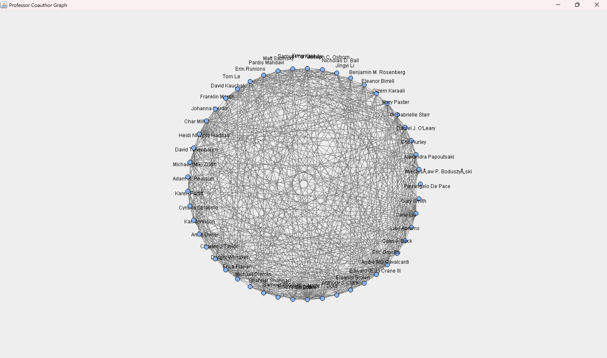
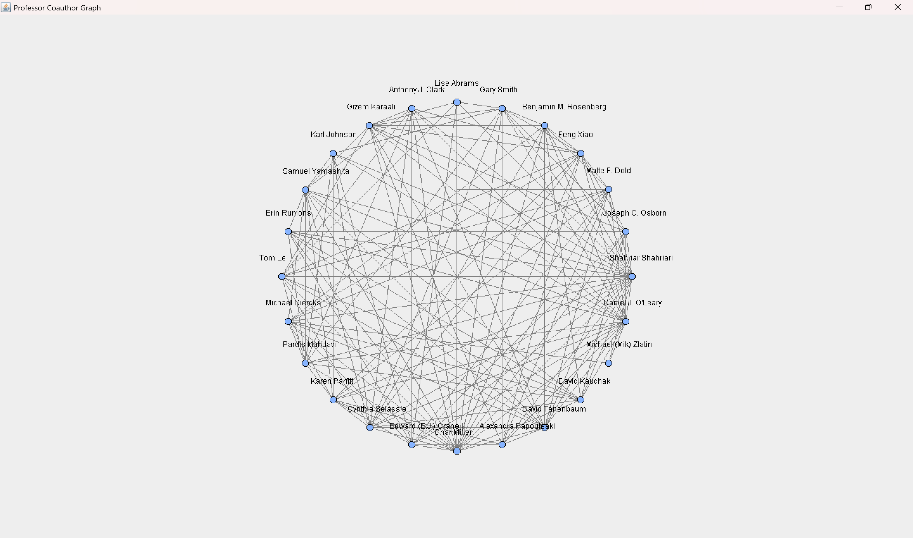

# stalkMyProfessor
College serves as the opportunity for many to develop their expertise towards a future career, and this growth occurs through both coursework and professor-led research. However, discovering the right research opportunities is quite the challenge. Even at a smaller institution like Pomona College, a faculty size of 286 is simply overlooked by many students who do not even know where to start searching, on top of their busy schedules. Prof-interest/StalkMyProfessors aims to assist students in connecting with faculty who share their specific research interest. Using Prof-interest/StalkMyProfessors, professors searchable by research topics, sorted by identifying information, and mapped across interdisciplinary fields are just a few clicks away.

## Setup
Run the main() method on the UserInterface.java file for a terminal interface. Requires keyboard.

## Features
### Help
Entering '0' returns a list of professors along with their name, department, and number of papers. This is to allow for easy copying and spell checking of professor and/or department names.
~~~text
--------------------------
Enter 1 to search one professor with exact full name,
Enter 2 for professor list under one department, in descending order of published paper number,
Enter 3 for a graph of all professors and coauthors, 
Enter 4 for a graph of one professor and their coauthors' connections,
Enter 0 to see full list of professors available. 
Enter your choice: 0
~~~
### Professor search by name
  Entering '1' prompts the user to type the name of the professor (e.g. 'Shahriar Shahriari'), which will then return the professor's name, title, department, email, personal website, interests, and a list of all all the papers they have created.
~~~text
--------------------------
Enter 1 to search one professor with exact full name,
Enter 2 for professor list under one department, in descending order of published paper number,
Enter 3 for a graph of all professors and coauthors, 
Enter 4 for a graph of one professor and their coauthors' connections,
Enter 0 to see full list of professors available. 
Enter your choice: 1
Enter the name of the Professor you'd like to learn more about: Shahriar Shahriari
~~~
### Professor Search Department List
Entering '2' prompts the user to type the name of the department to sort by (e.g. 'Computer Science'), which will return a list of every professor in the department along with the number of papers each professor has written.
~~~text
--------------------------
Enter 1 to search one professor with exact full name,
Enter 2 for professor list under one department, in descending order of published paper number,
Enter 3 for a graph of all professors and coauthors, 
Enter 4 for a graph of one professor and their coauthors' connections,
Enter 0 to see full list of professors available. 
Enter your choice: 2
Enter the department you'd like to learn more about: Computer Science
~~~
### Professor Coauthor Graph
Entering '3' opens a window that displays a graph where each node is a professor and each edge represents a paper coauthored by both professors.
~~~text
--------------------------
Enter 1 to search one professor with exact full name,
Enter 2 for professor list under one department, in descending order of published paper number,
Enter 3 for a graph of all professors and coauthors, 
Enter 4 for a graph of one professor and their coauthors' connections,
Enter 0 to see full list of professors available. 
Enter your choice: 3
~~~

### Professor Coauthor Graph by Name
Entering '4' prompts the user for the name of the professor (e.g. 'Shahriar Shahriari'), which will then open a window that displays a graph where the node furthest to the right is the targeted professor and every other node is a professor they have coauthored a paper with. Edges between each node represents the papers each professor has coauthored with another.
~~~text
--------------------------
Enter 1 to search one professor with exact full name,
Enter 2 for professor list under one department, in descending order of published paper number,
Enter 3 for a graph of all professors and coauthors, 
Enter 4 for a graph of one professor and their coauthors' connections,
Enter 0 to see full list of professors available. 
Enter your choice: 4
Enter the professor name for the graph: Shahriar Shahriari
~~~

### Exit
Entering '5' or 'Exit' closes the program.
# Credits

Built by Max Liu, Joshua Oyadomari-Chun, Sophie Park, and Fred Wang. | CS62 Final Project, Spring 2026
